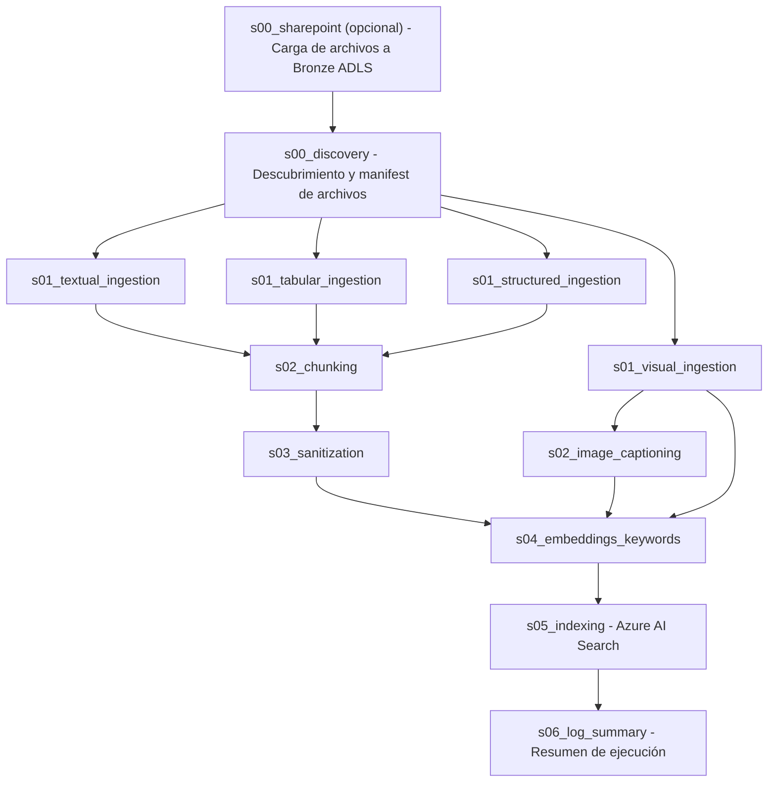

# Arquitectura del flujo de indexacion (`workflow`)

## 1) Objetivo

Este documento describe el comportamiento actual del pipeline de indexacion implementado en `src/steps/indexing`.

Objetivo funcional del flujo:

1. (opcional) sincronizar documentos desde SharePoint Online hacia la capa Bronze en ADLS bajo el mismo prefijo que usara el discovery,
2. descubrir archivos en ADLS,
3. clasificar y preparar contenido por tipo de documento,
4. fragmentar y sanitizar contenido textual,
5. generar captions, embeddings y keywords,
6. indexar en Azure AI Search,
7. consolidar observabilidad de ejecucion.

## 2) Vista de alto nivel

En Databricks, el job de indexacion declara `s00_sharepoint` como task previo a `s00_discovery`. Si `config.indexing.sharepoint_sync_enabled` no es `true` (o `config.sharepoint.enabled` es `false`), el paso SharePoint no sincroniza nada y solo registra el estado en su log en Silver.

## 3) Flujo de datos implementado

### s00_sharepoint

- Script: `src/steps/indexing/s00_sharepoint.py`.
- Usa `SharePointToBronzeProcess` (`src/core/sharepoint/sharepoint_connection.py`) para copiar archivos desde la biblioteca/carpeta configurada en `config.sharepoint` hacia el **contenedor ADLS `bronze`**.
- El prefijo de destino bajo `bronze` se alinea con **`indexing_manifest.yaml` → `s00_discovery` → `raw_documents` → `path_prefix`** (por ejemplo `indexing`), sobrescribiendo `sharepoint.bronze_folder` solo para este flujo, de modo que `s00_discovery` liste los mismos blobs.
- Opciones de ejecucion (`max_folders`, `only_folder`, `since_date`): `indexing_manifest.yaml` → `steps.s00_sharepoint.options`. Cada clave es opcional; `null` o ausencia equivale a no aplicar ese filtro (ver `docs/configuration.md` §7).
- Activa la sincronizacion real solo si:
  - `indexing.sharepoint_sync_enabled == true` en `config/config.yaml`, y
  - `sharepoint.enabled != false`.
- El `StepLogger` guarda en Silver `step_metadata` con, entre otros: `sync_ran`, `sync_disabled_reason` (si no corre), `bronze_prefix`, y contadores del proceso (`documents_synced`, `skipped_unchanged`, `skipped_since_date`, `failed`).

### s00_discovery

- escanea `bronze` usando `path_prefix` definido en el manifest,
- ignora rutas que comienzan con `bronze/`, `silver/` o `gold/` cuando existen en el mismo contenedor,
- clasifica archivos por extension en:
  - `textual`: `.pdf`, `.docx`, `.txt`, `.pptx`
  - `tabular`: `.csv`, `.xlsx`, `.xls`
  - `images`: `.png`, `.jpg`, `.jpeg`, `.tiff`, `.webp`, `.gif`, `.bmp`
  - `structured`: `.json`, `.parquet`, `.delta`
- ignora extensiones desconocidas y las registra como error de discovery,
- copia cada archivo descubierto a staging en Silver por grupo y extension:
  - `silver/steps_indexing/source=s00_discovery/.../staging/<group>/<ext>/<filename>`
- genera:
  - `discovery_manifest.json`
  - `discovery_report.txt`

Salida principal:

- `silver/steps_indexing/source=s00_discovery/.../discovery/discovery_manifest.json`

Cada item de `discovery_manifest.json` incluye:

- `file_path`: ruta original en Bronze,
- `staged_path`: ruta copiada a Silver,
- `filename`,
- `group`,
- `extension`,
- `size_bytes`,
- `discovered_at` (hora America/Bogota, ISO naive).

### s01_textual_ingestion

- lee el ultimo `discovery_manifest.json` desde `steps_indexing/source=s00_discovery`,
- filtra `group == "textual"`,
- descarga cada archivo con prioridad:
  1. `staged_path` en Silver,
  2. fallback a `file_path` en Bronze,
- normaliza el archivo a `DocumentIR` usando `FileExtractor` + `IRNormalizer`,
- agrega metadata adicional:
  - `original_filename`
  - `source_path`
  - `read_from`
  - `ingestion_date`

Salida:

- `silver/steps_indexing/source=s01_textual/.../ingestion/ir/ir_data.json`

### s01_visual_ingestion

- lee el ultimo `discovery_manifest.json`,
- filtra `group == "images"` y extensiones soportadas:
  - `.png`, `.jpg`, `.jpeg`, `.tiff`, `.bmp`, `.gif`, `.webp`
- descarga con prioridad `staged_path -> file_path`,
- extrae metadata tecnica de imagen con Pillow:
  - `width_px`
  - `height_px`
  - `color_mode`
  - `image_format`
- normaliza `type_source` por extension a mime type:
  - por ejemplo `image/png`, `image/jpeg`, `image/webp`
- si OCR esta configurado y el mime es soportado, intenta OCR best-effort,
- agrega en metadata:
  - `ocr_text`
  - `ocr_characters`
  - `ocr_applied`
  - `read_from`
  - `ingestion_date`

Salida:

- `silver/steps_indexing/source=s01_visual_ingestion/.../ingestion/images/images_metadata.json`

### s01_tabular_ingestion

- lee el ultimo `discovery_manifest.json`,
- filtra `group == "tabular"` y extensiones soportadas:
  - `.csv`, `.xlsx`, `.xls`
- descarga con prioridad `staged_path -> file_path`,
- carga el archivo con Pandas,
- valida que exista la columna obligatoria `content`,
- rechaza el archivo si no existe `content`,
- por cada fila con contenido no vacio:
  - usa `content` como texto principal,
  - mueve el resto de columnas a `metadata`,
  - agrega `read_from` en metadata

Salida:

- `silver/steps_indexing/source=s01_tabular_ingestion/.../ingestion/tabular/tabular_data.json`

### s01_structured_ingestion

- lee el ultimo `discovery_manifest.json`,
- filtra `group == "structured"` y extensiones soportadas:
  - `.json`, `.parquet`, `.delta`
- descarga con prioridad `staged_path -> file_path`,
- parsea segun extension:
  - `.json`: JSON documento o JSON lines
  - `.parquet`: PyArrow
  - `.delta`: en modo local no se procesa y devuelve sin registros
- para `.json`, rechaza estructuras heterogeneas,
- resuelve campos de contenido con esta prioridad:
  1. mapping conocido en `config.yaml -> json_file_structure.mappings`
  2. inferencia con LLM
  3. fallback heuristico buscando columnas textuales
- si no encuentra campos utiles para RAG, omite el archivo,
- construye `content` concatenando `field: value`,
- omite filas con contenido menor a `MIN_CONTENT_CHARS` (50),
- agrega metadata:
  - campos metadata seleccionados,
  - `_structure_analysis` con detalle del origen del mapping,
  - `read_from`

Salida:

- `silver/steps_indexing/source=s01_structured_ingestion/.../ingestion/structured/structured_data.json`

### s02_chunking

- consume:
  - `ir_data` desde `s01_textual`
  - `tabular_data` desde `s01_tabular_ingestion`
  - `structured_data` desde `s01_structured_ingestion`
- transforma tabular y structured al shape de `DocumentIR`,
- si no hay datos de entrada, termina sin generar salida,
- selecciona estrategia de chunking desde `processing.chunking.type_chunking`,
- puede aplicar override simple para Markdown cuando `mime_type == "text/markdown"` y existe override de `*.md`,
- genera chunks usando `src/core/chunking/router.py`,
- registra la estrategia efectiva usada por documento.

Salida:

- `silver/steps_indexing/source=s02_chunking/.../processing/chunks/chunks_data.json`

### s02_image_captioning

- consume `images_metadata` desde `s01_visual_ingestion`,
- si no encuentra metadata de imagen, sube un `image_captions.json` vacio,
- aplica estrategia OCR-first:
  1. usa `metadata.ocr_text` si ya existe,
  2. si no existe, intenta OCR sobre los bytes de la imagen,
  3. si no hay OCR util y captioning esta habilitado, genera caption con LLM vision,
  4. si todo lo anterior falla, usa fallback textual generico:
     - `Imagen <file_name> ubicada en <source_path>.`
- normaliza la salida como texto indexable,
- registra metadata como:
  - `origin`: `image_ocr` o `image_captioning`
  - `mime_type`
  - `ocr_applied`

Salida:

- `silver/steps_indexing/source=s02_image_captioning/.../processing/image_captions/image_captions.json`

### s03_sanitization

- consume `chunks_data.json`,
- aplica sanitizacion PII usando `PIIFilter` solo si `security.pii.enabled == true`,
- si PII esta deshabilitado, hace passthrough del contenido y mantiene el contrato de salida,
- marca siempre en metadata:
  - `sanitized = true`
  - `source_step = "s03_sanitization"`

Salida:

- `silver/steps_indexing/source=s03_sanitization/.../processing/sanitized/sanitized_chunks.json`

### s04_embeddings_keywords

- consume:
  - `sanitized_chunks` desde `s03_sanitization`
  - `image_captions` desde `s02_image_captioning`
- transforma captions de imagen a un shape compatible con chunks:
  - `strategy = "image_captioning"`
  - `is_image_caption = true`
- genera embeddings por lotes con `EmbeddingsGenerator`,
- marca en metadata:
  - `embedded = true`
  - `source_step = "s04_embeddings_keywords"`
- keywords:
  - solo se generan si `embeddings.keywords.enabled == true`,
  - usa LLM si hay cliente y deployment configurados,
  - si el LLM falla al responder, usa fallback heuristico por frecuencia de tokens,
  - si keywords esta deshabilitado o el cliente no esta disponible, deja `keywords` vacio.

Salida:

- `silver/steps_indexing/source=s04_embeddings_keywords/.../processing/embeddings/embeddings_data.json`

### s05_indexing

- consume `embeddings_data.json`,
- crea o valida el indice en Azure AI Search con `ensure_index_exists(...)`,
- construye un ID deterministico por documento para soportar idempotencia,
- indexa solo items que tengan `content` y `vector`,
- resuelve metadata para Search:
  - `source`: prioriza `original_filename`
  - `type_source`: normaliza mime conocidos a etiquetas cortas
    - `application/pdf -> pdf`
    - `text/plain -> txt`
    - `text/markdown -> markdown`
    - `application/vnd.openxmlformats-officedocument.wordprocessingml.document -> docx`
    - `application/msword -> doc`
    - `application/vnd.openxmlformats-officedocument.presentationml.presentation -> pptx`
    - `application/vnd.ms-powerpoint -> ppt`
    - `application/json -> json`
- hace upsert de documentos en el indice,
- lista IDs existentes y elimina documentos obsoletos que ya no aparecen en el run actual.

Salida:

- indice externo de Azure AI Search

### s06_log_summary

- consume logs desde `silver/logs_indexing/<run_id>/`,
- consolida el estado final del run,
- escribe el resumen en:
  - `gold/logs_indexing/<run_id>/run_summary.json`
- si existe el log `s00_sharepoint.json`, incorpora un bloque **`sharepoint_indexing`** con:
  - flags de configuracion (`indexing_sharepoint_sync_enabled_config`, `sharepoint_enabled_config`),
  - si se encontro el log del step (`step_log_found`),
  - si la sincronizacion se ejecuto (`sync_ran`) y motivo de omision si aplica (`sync_disabled_reason`),
  - prefijo Bronze usado (`bronze_prefix`),
  - contadores del sync (`documents_synced`, omitidos, fallidos),
- duplica el total de documentos sincronizados desde SharePoint en **`metrics.sharepoint_documents_synced`** para alinearlo con el resto de metricas del run.

## 4) Capas de salida por step

- `s00_sharepoint`: escribe blobs en **Bronze** (via proceso SharePoint); observabilidad en **Silver** (`logs_indexing/<run_id>/s00_sharepoint.json`).
- `s00` discovery a `s04`: **Silver** (artefactos de datos y logs por step).
- `s05`: **Azure AI Search** (indice externo)
- `s06`: **Gold**

## 5) Observabilidad

Todos los steps de indexacion registran eventos con `StepLogger` en `silver/logs_indexing/<run_id>/<step>.json`.

El payload puede incluir campos estructurados opcionales en **`step_metadata`** (por ejemplo el paso `s00_sharepoint`).

`s06_log_summary` consolida tipicamente:

- estado global,
- conteos de entrada y salida,
- errores por step,
- archivos procesados,
- metricas agregadas del run,
- bloque **`sharepoint_indexing`** y **`metrics.sharepoint_documents_synced`** cuando aplica el paso SharePoint en indexacion.

## 6) Archivos clave

- orquestacion: `resources/indexing_workflow.yml`
- config funcional: `config/config.yaml` (seccion `indexing` para activar SharePoint antes del discovery)
- contrato logico: `config/indexing_manifest.yaml`
- implementacion steps: `src/steps/indexing/*.py`
