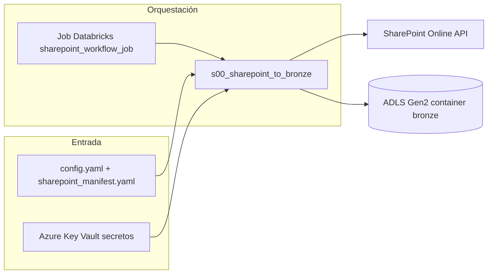

# Arquitectura: workflow SharePoint → Bronze

Este documento describe cómo funciona la sincronización de contenido desde **SharePoint Online** hacia la capa **Bronze** en **Azure Data Lake Storage Gen2** (filesystem `bronze`), tal como está implementada en el repositorio.

## Objetivo

Copiar de forma reproducible archivos de documentos (PDF, Office, texto, etc.) desde una ruta de biblioteca/carpeta en SharePoint hacia ADLS, conservando la estructura de carpetas relativa a la ruta configurada y registrando la fecha de modificación de SharePoint en metadata del blob para permitir sincronizaciones incrementales.

## Vista de alto nivel

## Orquestación (Databricks)

El bundle define un job cuyo único task ejecuta el script Python del paso:

- **Definición**: `resources/sharepoint_workflow.yml`
- **Task**: `s00_sharepoint_to_bronze`
- **Script**: `src/steps/sharepoint/s00_sharepoint_to_bronze.py`
- **Parámetros típicos**: `--config` (`config/config.yaml`), `--manifest` (`config/sharepoint_manifest.yaml`), `--run_id`, `--task_run_id` (placeholders del job)

El cluster instala dependencias necesarias (PyYAML, `azure-identity`, `azure-keyvault-secrets`, `azure-storage-file-datalake`, `Office365-REST-Python-Client`).

## Punto de entrada del paso

`s00_sharepoint_to_bronze.py`:

1. Carga **config** y **manifest** y construye un `StepContext`.
2. Si `config.sharepoint.enabled` es `false`, el paso **no hace nada** (solo registra advertencia y conteos en cero).
3. Lee opciones de ejecución desde `manifest.workflow.steps.s00_sharepoint_to_bronze.options` (`max_folders`, `only_folder`, `since_date`).
4. Ejecuta de forma asíncrona `SharePointToBronzeProcess.run(...)` usando un patrón que evita conflictos con un event loop ya activo (p. ej. en notebooks).

El núcleo de la lógica está en `src/core/sharepoint/sharepoint_connection.py`, clase **`SharePointToBronzeProcess`**.

## Configuración

### `config.yaml` — sección `sharepoint`

| Concepto | Descripción |
|----------|-------------|
| `enabled` | Activa o desactiva el workflow sin quitar el job. |
| `site_url`, `client_id`, `client_secret`, `relative_path` | Conexión app-only a SharePoint; suelen resolverse con placeholders `${KV-...}` vía `load_config` / Key Vault. |
| `bronze_folder` | Carpeta (prefijo) **dentro del filesystem `bronze`** donde se escriben los archivos. Si es `null` o no aplica, se usa el **último segmento** de `relative_path`. |
| `skip_sync_if_unchanged` | Si es `true` (por defecto), no se vuelve a descargar/subir si el blob en Bronze ya tiene metadata `sp_modified` igual a la fecha de modificación en SharePoint. |

Si los cuatro campos de conexión no están todos resueltos en config, el código puede obtenerlos directamente por nombre desde Key Vault (mismos secretos documentados en el manifest).

### `sharepoint_manifest.yaml`

Declara el paso en el modelo de workflow (catálogo, esquema, inputs/outputs lógicos con `path_prefix: "sharepoint"` para alinear con la medallion). Las **opciones de ejecución** del proceso (`max_folders`, `only_folder`, `since_date`) viven en `workflow.steps.s00_sharepoint_to_bronze.options`.

## Flujo interno de `SharePointToBronzeProcess`

### 1. Conexión a SharePoint

- Se construye un **`SimpleSharePointClient`** con autenticación **client credentials** (Office365 REST).
- La `site_url` se **normaliza** a la raíz del sitio (`.../sites/Nombre` o `.../teams/...`), no a una URL de vista de biblioteca (`AllItems.aspx`).
- `assert_authenticated` valida que el token app-only funcione; si falla, el paso termina con error explícito (permisos Entra ID, secret, URL, etc.).

### 2. Conexión a ADLS (Bronze)

- Se obtiene el **uploader** medallion (`get_uploader`), inicializado con el secreto de cuenta de almacenamiento y **container `bronze`**.
- Si ADLS no puede inicializarse (cuenta, identidad administrada, permisos), el proceso falla antes de copiar datos.

### 3. Qué “raíz” se procesa en SharePoint

- Se lista el contenido de **`relative_path`** como carpeta: si hay **subcarpetas**, cada una se trata como una rama (`base_sp_path/nombre_carpeta`).
- **Filtros** (desde manifest `options`):
  - **`only_folder`**: solo la subcarpeta cuyo nombre coincide (case-insensitive).
  - **`max_folders`**: limita cuántas ramas de primer nivel se procesan.
- Si **no hay subcarpetas**, se procesa directamente la carpeta configurada en `relative_path`. En ese caso, si se usa `only_folder`, debe coincidir con el nombre de la carpeta en la ruta; si no, no se ingiere nada.

### 4. Ingesta por rama (`_ingest_sharepoint_branch`)

Para cada rama:

1. Se **explora recursivamente** la carpeta en SharePoint y se recolectan metadatos de archivos con extensiones relevantes (**pdf, docx, xlsx, pptx, txt, doc, xls, ppt**). Carpetas como `Forms` o que empiezan por `.` se ignoran en la exploración.
2. **`since_date`** (opcional): se omiten archivos cuya fecha de modificación en SharePoint no es posterior a esa fecha (checkpoint temporal).
3. **`skip_sync_if_unchanged`**: si el blob ya existe en Bronze con metadata **`sp_modified`** coincidente con la revisión actual en SharePoint, el archivo se **omite** (no redescarga).
4. Si hace falta sincronizar: se **descarga** el contenido desde SharePoint y se **sube** al path bajo el destino Bronze.

### 5. Rutas en ADLS

- La raíz de escritura es **`bronze_folder`** (o el último segmento de `relative_path`).
- Debajo se **replica la estructura relativa** respecto a `base_sp_path` (`_relative_paths`), de modo que subcarpetas en SharePoint se reflejan en ADLS.

### 6. Contenido y metadata

- Texto plano/markdown: se decodifica y se sube como bytes UTF-8 según corresponda.
- Binarios: en la descarga intermedia pueden representarse en base64; antes de subir se vuelve a **bytes** para el blob.
- Tras `upload_data`, se intenta fijar metadata del blob **`sp_modified`** (ISO) para las ejecuciones futuras con `skip_sync_if_unchanged`.

## Resumen operativo

| Pregunta | Respuesta breve |
|----------|-----------------|
| ¿Dónde se configura la carpeta de SharePoint? | `relative_path` (config o Key Vault). |
| ¿Dónde aparecen los datos en el lake? | Container **`bronze`**, bajo el prefijo dado por **`bronze_folder`** (o derivado de `relative_path`). |
| ¿Cómo se evita trabajo innecesario? | `skip_sync_if_unchanged` + metadata `sp_modified` en el blob. |
| ¿Cómo limitar alcance? | `only_folder`, `max_folders`, `since_date` en `sharepoint_manifest.yaml`. |

Para personalización detallada de manifests y convenciones del framework, ver también `docs/customization.md`.
