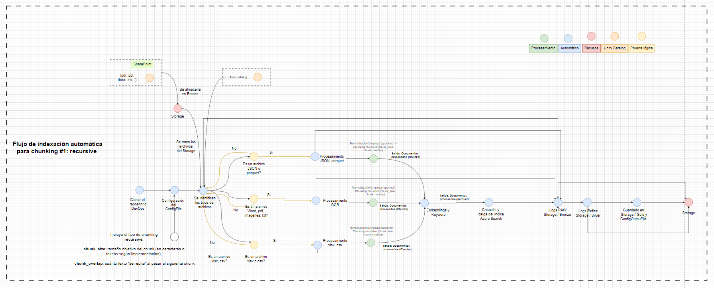
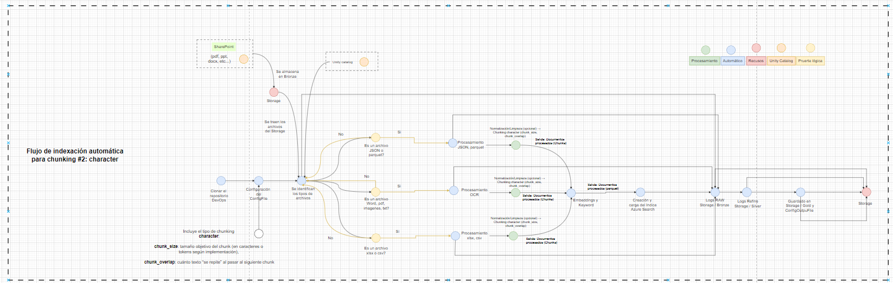
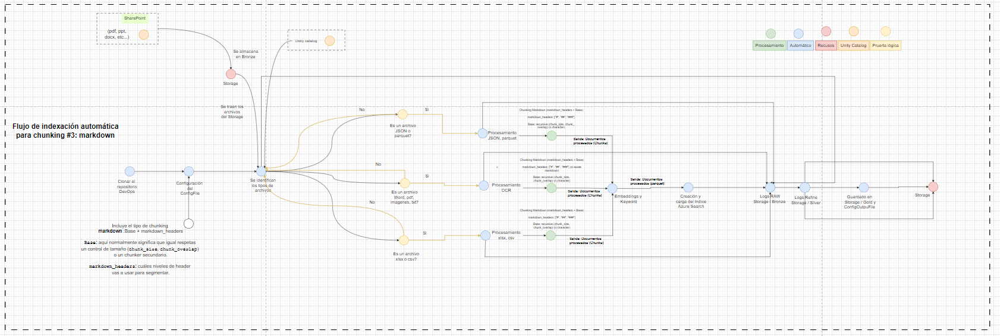
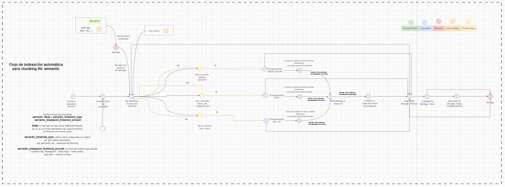
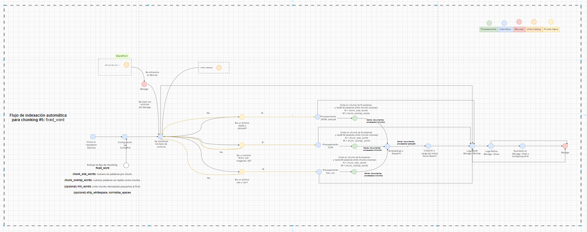

# Objetivo 

Definir lineamientos para seleccionar y parametrizar los **tipos de chunking** disponibles en el flujo de indexación del Framework de LLMOps, incluyendo: 

- Parámetros requeridos y opcionales (con **rangos recomendados** cuando aplique). 

- Cómo funciona cada estrategia. 

- En qué **tipos de documento/casos** se recomienda cada una. 

- Riesgos típicos y buenas prácticas de uso. 

# Principios generales

## ¿Qué es chunking? 

Chunking es el proceso de dividir un documento en fragmentos (chunks) antes de crear embeddings e indexarlos. El objetivo es que cada fragmento sea: 

- lo suficientemente pequeño para recuperarse con precisión, 

- lo suficientemente completo para mantener contexto, 

- y lo suficientemente estable para no degradar la calidad del embedding y la recuperación 

## ¿Para qué sirve en el flujo de indexación? 

En un flujo típico de RAG / búsqueda híbrida: 

1. Se extrae texto + metadatos 

2. Se limpia/normaliza 

3. Se hace chunking 

4. Se generan embeddings por chunk 

5. Se indexa (vector + keywords + metadata) 

6. En consulta: se recuperan chunks relevantes para responder 

El chunking impacta directamente: 

- **Recall** (qué tanto “encuentra” contenido relevante), 

- **Precision** (qué tan exacto es lo recuperado), 

- **Faithfulness** (si el contexto recuperado soporta la respuesta), 

- costos (número de chunks → embeddings → almacenamiento), 

- latencia (más chunks → más candidatos y re-ranking). 

## Ejemplo simple (ilustrativo) 

Documento (párrafo largo) → se divide en chunks: 

- Chunk 1: “Política de viáticos… definiciones… aplica para…” 

- Chunk 2: “Montos máximos… excepciones…” 

- Chunk 3: “Procedimiento… aprobaciones…” 

Con overlap, el final del chunk 1 se repite al inicio del chunk 2 para mantener continuidad. 

# Dónde configurar el tipo de chunking

La selección del tipo de chunking se define en `workflow/config/config.yaml`, en la ruta:

-- `processing.chunking.type_chunking`: estrategia que se utiliza para el tipo de chunking.
- `processing.chunking.strategy_overrides`: override por patrón de archivo (por ejemplo `*.md`).

El job de indexación (`workflow/resources/indexing_workflow.yml`) solo invoca `s02_chunking.py` y le pasa este `config.yaml`; ahí no se define la estrategia.

## Tipos soportados actualmente en código

- `fixed_word`
- `recursive`
- `character`
- `markdown`
- `semantic`

Nota: evitar `record` en `strategy_overrides` mientras no exista una estrategia `record` implementada en `src/core/chunking/router.py`.

# Campos de configuración usados por chunking

Todos estos campos se leen desde `processing.chunking` en `workflow/config/config.yaml` y se consumen en `src/steps/indexing/s02_chunking.py`.

## Campos generales

- **`type_chunking`**: tipo de estrategia de chunking por defecto (`fixed_word`, `recursive`, `character`, `markdown`, `semantic`).
- **`strategy_overrides`**: mapa de patrones (extensión o mime) a una estrategia específica distinta de `type_chunking`.
- **`chunk_size`**: tamaño base de chunk (normalmente en caracteres); se usa directo o como fallback según la estrategia.
- **`chunk_overlap`**: número de caracteres de solape entre chunks; también puede actuar como fallback en algunas estrategias.

## Campos por estrategia

### Fixed Word

- **`chunk_size_words`**: número de palabras por chunk.
- **`chunk_overlap_words`**: número de palabras que se solapan entre chunks.
- **`min_words`**: tamaño mínimo para el último chunk; evita trozos demasiado pequeños.
- **`strip_whitespace`**: elimina espacios en blanco al inicio y final del texto del chunk.
- **`normalize_spaces`**: normaliza espacios múltiples en uno solo (incluye saltos de línea, tabs, etc.).

### Recursive

- **`chunk_size`**: objetivo de longitud en caracteres por chunk.
- **`chunk_overlap`**: solape en caracteres entre chunks consecutivos.
- **`separators`**: lista ordenada de separadores para intentar cortes “naturales” (por ejemplo `["\n\n", "\n", ". ", " "]`).
- **`keep_separator`**: si es `true`, conserva los separadores en el texto del chunk.
- **`recursive_is_separator_regex`**: si es `true`, interpreta los separadores como expresiones regulares.

### Character

- **`size`**: tamaño objetivo del chunk en caracteres (si no se define, usa `chunk_size`).
- **`overlap`**: solape en caracteres entre chunks (si no se define, usa `chunk_overlap`).
- **`separator`**: separador preferido para intentar cortar (por ejemplo `"\n\n"`).
- **`is_separator_regex`**: si es `true`, el separador se trata como regex.

### Markdown

- **`chunk_size`**: longitud objetivo de los chunks de markdown (además de cortes por estructura).
- **`chunk_overlap`**: solape en caracteres entre chunks.
- **`markdown_headers`**: lista de pares `[prefijo, etiqueta]` para indicar qué headers markdown usar al segmentar (por ejemplo `["##", "h2"]`).

### Semantic

- **`chunk_size`**: tamaño aproximado de los bloques sobre los que se calcula similitud semántica.
- **`chunk_overlap`**: solape en caracteres entre bloques previos al análisis semántico.
- **`semantic_threshold_type`**: cómo se interpreta el umbral de corte (por ejemplo `"percentile"`).
- **`semantic_breakpoint_threshold_amount`**: valor numérico del umbral (por ejemplo `95.0` para percentil 95).
- **`semantic_embedding_model`**: nombre del modelo de embeddings usado para medir similitud.

### Compatibilidad hacia atrás

- **`extra_params`**: diccionario de parámetros adicionales no modelados explícitamente; se mantiene para compatibilidad y extensiones puntuales.

# Tipos de Chunking 

A continuación, se explican los tipos de chunking que están disponibles en el flujo de indexación en el Framework de LLMOps. 

## Chunking Recursive 

### Cómo funciona 

Divide el texto intentando mantener límites “naturales” con una jerarquía de separadores (ej.: doble salto de línea → salto de línea → punto → espacio). Si un fragmento aún excede el tamaño objetivo, aplica el siguiente separador, y así sucesivamente (por eso “recursive”). 

### Parámetros 

- `chunk_size` (requerido): tamaño objetivo por chunk (tokens o caracteres). 

Rangos recomendados: 

- Tokens: 300–800 (hasta 1,000 si el contenido requiere mucho contexto). 

- Caracteres: 1,200–3,500 (hasta 4,500 en narrativas largas). 

- `chunk_overlap` (requerido): texto repetido entre chunks. 
- `separators` (opcional): jerarquía de separadores para cortes naturales.
- `keep_separator` (opcional): conserva separadores en salida (default `true`).
- `recursive_is_separator_regex` (opcional): interpreta separadores como regex.

Rangos recomendados: 10%–20% del chunk_size. 

### Ventajas 

- Buen balance general: respeta párrafos/oraciones cuando puede. 

- Robusto ante texto “plano” (sin estructura formal). 

- Suele ser un “default” seguro. 

### Recomendado para 

- PDFs extraídos a texto sin estructura confiable. 

- Documentos legales o técnicos “planos” (sin Markdown). 

- Cualquier caso donde quieras un baseline estable. 

## Chunking Character 

### Cómo funciona 

Corta por longitud fija aproximada (caracteres) con overlap, sin intentar “entender” estructura (puede cortar a mitad de oración si no se implementa un ajuste por separadores). 

### Parámetros 

- `size` (opcional): tamaño objetivo por chunk (caracteres).
- `overlap` (opcional): overlap específico para estrategia character.
- `separator` (opcional): separador preferido.
- `is_separator_regex` (opcional): interpreta `separator` como regex.
- Fallbacks: `size -> chunk_size`, `overlap -> chunk_overlap`.

Rangos recomendados: 

- Caracteres: 1,000–2,500 (hasta 3,000 si hay oraciones largas). 

- `chunk_overlap` (si no se define `overlap`): repetición entre chunks. 

- Rangos recomendados: 150–500 caracteres (o 10%–20%). 

### Ventajas 

- Simple, rápido, predecible. 

- Útil cuando el texto viene “sucio” o muy irregular y necesitas control estricto. 

### Recomendado para 

- Contenido altamente irregular (logs, dumps, textos pegados). 

- Casos donde prima control estricto de tamaño (y aceptas pérdida semántica). 

- Como “fallback” cuando fallan chunkers estructurales.  

## Chunking Markdown (Base + markdown_headers) 

### Cómo funciona 

Primero segmenta según headers Markdown (ej. #, ##, ###), y luego aplica un “Base” chunker (normalmente size/overlap) para evitar chunks enormes dentro de una sección. 

### Parámetros 

- Base: `chunk_size`, `chunk_overlap`.
- `markdown_headers` (opcional): headers configurados para segmentación estructural.

### Recomendación: 

- Tokens: 400–900 

- Overlap: 10%–15% (markdown ya aporta coherencia, suele requerir menos overlap). 

- Valores típicos: `[["#", "h1"], ["##", "h2"], ["###", "h3"]]`.

### Recomendación práctica: 

- Para docs bien estructurados: usa hasta ### o ####. 

- Si hay demasiados headers pequeños, limita a ##–###. 

### Ventajas 

- Preserva jerarquía semántica: secciones y subsecciones. 

- Mejora recuperación cuando las preguntas se alinean con títulos (“Requisitos”, “Excepciones”, “Definiciones”). 

- Facilita metadatos como header_path (muy útil para trazabilidad). 

### Recomendado para 

- Documentación técnica en Markdown / wikis / repos. 

- Manuales con encabezados claros. 

- FAQs estructuradas. 

## Chunking Semantic (Base + semantic_threshold_type + semantic_breakpoint_threshold_amount) 

### Cómo funciona 

Identifica “puntos de quiebre” cuando detecta un cambio semántico entre segmentos consecutivos (por similitud/distancia de embeddings, o por reglas tipo percentil). Luego usa “Base” como limitador/fallback para que un chunk no crezca demasiado. 

### Parámetros 

- Base (recomendado como limitador): `chunk_size`, `chunk_overlap` 

- Tokens: 500–1,000 (semántico tiende a crear chunks “coherentes” pero variables) 

- Overlap: 5%–15% (a veces menos, porque el corte ya es “intencional”) 

- `semantic_threshold_type` (requerido): cómo se interpreta el umbral. 

Valores comunes (dependen de librería): 

- "cosine_similarity": similitud 0–1 (más alto = más parecido). 

- "cosine_distance": distancia 0–2 (más bajo = más parecido). 

- "percentile": 0–100 (corte si cae por debajo/encima del percentil). 

- "zscore" / "stddev": cortes por desviación respecto a distribución local. 

- `semantic_breakpoint_threshold_amount` (requerido): valor numérico del umbral. 
- `semantic_embedding_model` (opcional): modelo sentence-transformers para embeddings.

Rangos típicos: 

- Si es cosine_similarity: 0.70–0.90 como punto de partida. 

- ás bajo ⇒ más cortes (porque aceptas menos similitud para seguir juntando). 

- Más alto ⇒ menos cortes (exiges alta similitud para continuar). 

- Si es cosine_distance: 0.10–0.40 como punto de partida. 

- Más bajo ⇒ menos cortes (solo cortas con cambios fuertes). 

- Más alto ⇒ más cortes. 

- Si es percentile: 70–95 (según si cortas por “cambio fuerte”). 

- 70–80 ⇒ más cortes, 90–95 ⇒ menos cortes (en general). 

### Ventajas 

- Excelente cuando los temas cambian dentro del documento sin respetar estructura formal. 

- Reduce el riesgo de mezclar tópicos en el mismo chunk. 

### Recomendado para 

- Transcripciones, actas, documentos largos con cambios de tema. 

- PDFs extensos donde headings no son confiables. 

- Knowledge bases con secciones implícitas. 

## Chunking Fixed Word 

### Cómo funciona 

Divide por número de palabras por chunk, con overlap en palabras. Útil cuando quieres control más “lingüístico” y menos dependiente de tokenización. 

### Parámetros 

- chunk_size_words (requerido): # de palabras por chunk 

- Rangos recomendados: 150–350 palabras (hasta 500 si necesitas contexto). 

- chunk_overlap_words (requerido): # de palabras repetidas 

- Rangos recomendados: 20–60 (≈ 10%–20%). 

- min_words (opcional): evita chunks demasiado pequeños al final 

- Recomendación: 30–80 

- strip_whitespace (opcional): boolean 

- normalize_spaces (opcional): boolean 

### Ventajas 

- Muy estable entre idiomas y formatos (si el conteo de palabras es confiable). 

- Fácil de razonar y auditar (“chunks de 250 palabras”). 

### Recomendado para 

- Textos narrativos, artículos, transcripciones limpias. 

- Casos donde el conteo de palabras sea un estándar interno. 

- Cuando la tokenización exacta puede variar por modelo/proveedor y quieres estabilidad. 

